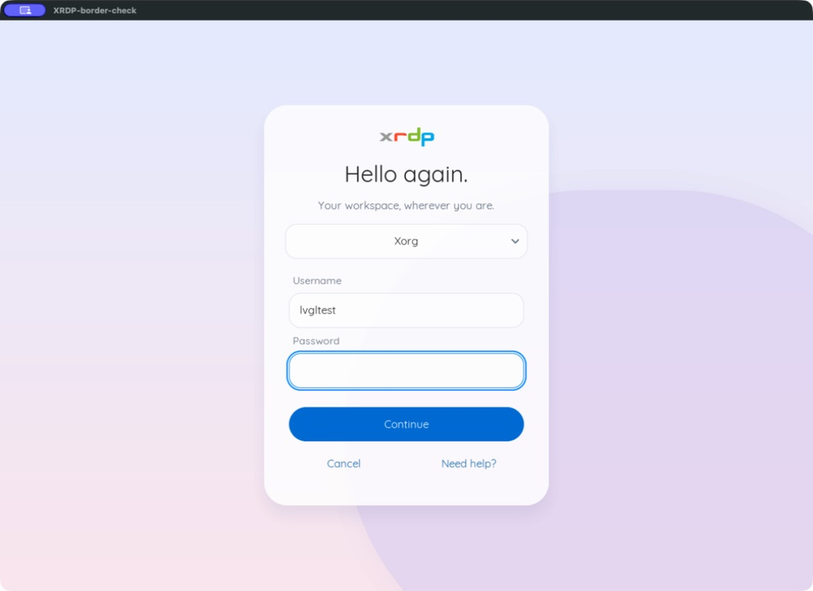
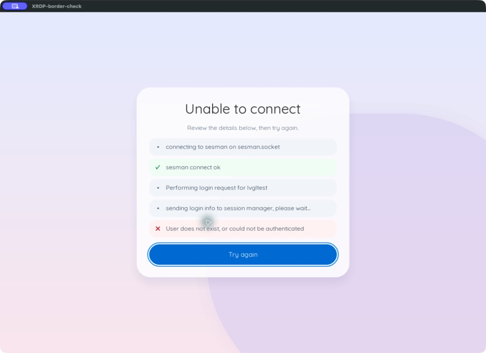

<!--
xrdp: A Remote Desktop Protocol server.

Copyright (C) Idan Freiberg 2026

Licensed under the Apache License, Version 2.0 (the "License");
you may not use this file except in compliance with the License.
You may obtain a copy of the License at

    http://www.apache.org/licenses/LICENSE-2.0

Unless required by applicable law or agreed to in writing, software
distributed under the License is distributed on an "AS IS" BASIS,
WITHOUT WARRANTIES OR CONDITIONS OF ANY KIND, either express or implied.
See the License for the specific language governing permissions and
limitations under the License.
-->

# Optional LVGL login interface

xrdp can use LVGL to draw its login form, help, connection progress and error
messages. It renders in software into memory and sends changed rectangles
through xrdp's existing painter. It does not start X11, Wayland, or another
process for the login UI. The desktop session still starts in the usual way.

## Screenshots

Captured from native FreeRDP on macOS connected to the Docker test server using
GFX. The connection log shows an intentionally failed login with the disposable
test account.





## Build

The default build has no LVGL or Fontconfig dependency. To enable the adapter:

```sh
./bootstrap
./configure --enable-lvgl
make
```

Install system development packages providing `lvgl.pc` (LVGL >= 9.3 and < 10)
and `fontconfig.pc`. LVGL 9.3.0 is the tested baseline. Later 9.x versions must
pass the configure feature check and the login tests. LVGL must provide:

- The system allocator (`LV_USE_STDLIB_MALLOC=LV_STDLIB_CLIB`), rather than
  the embedded fixed-size pool, which cannot safely support concurrent logins.
- Its standard global runtime (`LV_ENABLE_GLOBAL_CUSTOM=0`).
- Software rendering with `LV_USE_DRAW_SW=1`, `LV_DRAW_SW_COMPLEX=1`,
  `LV_DRAW_SW_SUPPORT_XRGB8888=1`, and `LV_DRAW_SW_DRAW_UNIT_CNT=1`.
- `LV_USE_LABEL`, `LV_USE_BUTTON`, `LV_USE_TEXTAREA`, `LV_USE_DROPDOWN`,
  `LV_USE_IMAGE`, `LV_USE_FLEX`, and `LV_USE_FREETYPE`, all enabled.
- `LV_TXT_ENC=LV_TXT_ENC_UTF8`.

LVGL is configurable at library build time. Headers (including `lv_conf.h`)
must match the installed library; changing only the consuming application's
macros is not sufficient. A package missing required features must be rebuilt
by its packager. xrdp neither downloads nor vendors the toolkit.

Configure fails if the requested library or features are missing. Include
required runtime libraries in the xrdp package's dependencies: the legacy
fallback cannot recover from the dynamic loader failing to load a linked
shared library.

## Enable or switch back

In the existing `[Globals]` section of `xrdp.ini`:

```ini
ls_ui=lvgl
; Optional: otherwise Fontconfig prefers Quicksand or Nunito Sans, then sans-serif.
; ls_font_file=/usr/share/fonts/truetype/dejavu/DejaVuSans.ttf
```

New connections use the selected interface. Set `ls_ui=legacy` to switch back.
Legacy is the default even in an LVGL-enabled build. An invalid setting or
failure to initialize the modern UI selects legacy; initialization errors are
logged without credentials. Fatal toolkit or allocator failures are not
recoverable through this fallback.

The modern interface uses a static pastel backdrop, a translucent rounded sheet,
a large greeting and a full-width primary action. Help and connection details
share the same styling. The surfaces are composited in software; there is no
live blur or decorative animation. The login form preserves configured session
choices, arbitrary `ask` fields and defaults, client prefilling, title, logo and background image.
Legacy widget coordinates and colors are not applied to the modern layout.
Image formats retain the existing xrdp image-loader requirements, including
`--with-imlib2` for non-BMP files. Logo alpha is preserved, including in custom
PNG logos. The default logo uses the bundled transparent PNG with Imlib2, or
removes the bundled BMP's uniform matte without Imlib2. Font coverage depends on
the chosen system font; this does not add an input method or a translation system.

For rounded typography throughout the modern interface, install a system
Quicksand font package (for example, `fonts-quicksand` on Debian/Ubuntu).
Nunito Sans is the next preference, followed by the system sans-serif fallback.
`ls_font_file` still overrides this selection. All sizes use FreeType rendering.
Connection details appear in separate rows with green checks for known completed
steps, red crosses for errors, amber warning markers and neutral progress dots.
Markers are drawn independently of the font's symbol coverage.

Keyboard layouts, Unicode input, Tab/Shift+Tab, Enter/Escape, cursor/editing
keys, mouse clicks and wheel scrolling are supported. Passwords are masked
immediately. Entries retain the legacy maximum of 255 bytes, including when
a character uses multiple UTF-8 bytes. Forms scroll on small displays.

15-, 16-, 24- and 32-bit clients use the modern renderer. 8-bit clients use
legacy. The backing framebuffer is limited to 16,777,216 pixels; larger initial
desktops also use legacy. Invalid or oversized subsequent geometry terminates
the connection instead of allocating unbounded memory or restarting login.

Both `fork=true` and `fork=false` work. Threaded connections have separate
displays, input groups, widgets and buffers. One mutex serializes LVGL access
within a process. Rendering callbacks only update bounded per-connection
storage; each connection sends its own RDP updates outside that mutex. Use
process mode if parallel rendering throughput matters. Timer deadlines use
the existing event loop, with no additional polling thread. Idle updates are
limited to changes such as the caret, rather than continuous full-screen frames.

## Check

Run `make check` in both build configurations. The existing xrdp test executable
includes shared form-data tests; enabled builds also exercise private pixel
conversion/clipping, separate displays, UTF-8 limits, password masking,
submission, retry and initialization cleanup.

A deterministic render can be saved from an enabled test build:

```sh
cd tests/xrdp
CK_RUN_SUITE=login XRDP_LVGL_SCREENSHOT=/tmp/login.bmp ./test_xrdp
```

For interactive validation, connect an RDP client with credential delegation
disabled (to display the form). Check login, help, failed authentication/retry,
autologin failure, session selection, small/high-DPI/multiple-monitor desktops,
and concurrent connections in both connection modes. Exercise both classic
bitmap updates and GFX. Confirm that successful login hands input and rendering
over to the desktop and that disconnecting one client leaves the others intact.
